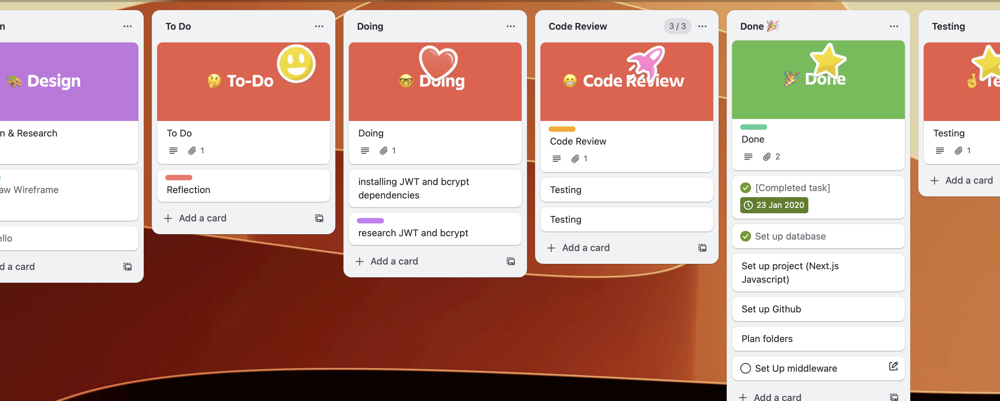
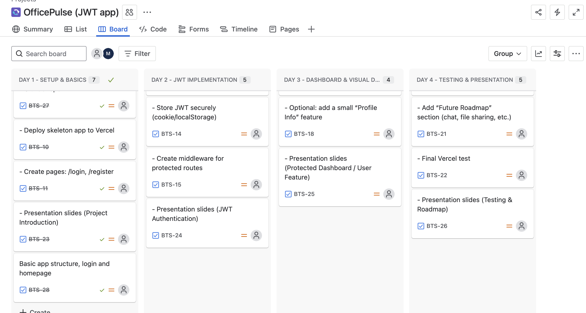

# OfficePulse is 🛡️ JWT Authentication Demo with Next.js — Research Project

This project is a beginner-friendly, research-based demonstration of how **JWT (JSON Web Tokens)** and **bcrypt** can be used for secure user authentication in a Next.js app — without relying on third-party services like Clerk, Auth0, or Firebase Auth.

---

## 📌 Project Goals

- 👩‍💻 Understand how **authentication** works 
- 🔐 Learn about **JWT and bcrypt** for secure login systems
- 🌐 Build a working **login/register flow** using **Next.js**
- 🚫 Highlight the **risks of insecure code (SQL injection, hardcoded secrets)**
- 🔎 Explore **real-life use cases** and why this method is still used in modern web apps

---

## 🔐 What is JWT (Json web token) and Bcrypt?​
​​
Imagine JWT as a special **digital badge** you get when you log into a website. It says, “This 
person is who they say they are.”​
- It’s a string of letters and numbers that holds your identity safely.​
- The website gives you this badge after you log in.​
- Every time you visit a protected page, you show this badge, so the website knows it’s you.​
### Bcrypt:​
bcrypt is like a secret recipe for locking your password so no one else can read it, 
even if they steal it.​
- When you sign up, bcrypt mixes your password with a special “salt” (extra secret stuff).​
- It scrambles it in a way that’s super hard to undo.​
- The server only stores this scrambled version — never your real password!​
- When you log in, bcrypt scrambles what you typed and compares it to the stored scrambled 
password to check if it matches.​
​
---

## 📂 Structure of JWT​

#### A JWT is like a secret sandwich with three tasty layers:​
- **Top Layer (Header):** The sandwich’s label — it tells what kind of sandwich it is 
and how it’s made (the recipe).​
- **Middle Layer (Payload):** The filling — all the important info about you, like 
your name or ID.​
- **Bottom Layer (Signature):** The sauce that holds it all together — it makes 
sure no one has messed with your sandwich!​
​
​---

## ䷬ Why use Both

**Imagine this:​**
- bcrypt is like your personal bodyguard, nobody gets past it
- JWT is a passport or a VIP badge that says I'm trusted

* Together, they keep the bad guys out and let the good guys party freely.​
​
---

## 👫 How They Work Together in Your App​
​
​​
- You register with a username and password.​
- Your password is hashed with bcrypt and saved securely.​
- You log in with your username and password.​
- Server checks your password with bcrypt.​
- If it matches, server creates a JWT token and sends it to your 
browser.​
- Your browser sends this token with every request to prove you 
are logged in.​

---

### 💡 Real-Life Examples

- 🔑 Internal tools at companies often use JWT and bcrypt for simple auth.

- 🎮 Games and mobile apps often use custom JWT flows to avoid service fees.

- 🔒 Banking dashboards use bcrypt for passwords + JWT for secure sessions.

---

### ✅ Benefits of This Approach

- 💡 Learn real-world authentication

- 🔐 You don’t have to depend on third-party services, the code is all yours and you own the whole setup

- 🔧 Customizable and extensible

- ⚙️ Perfect for microservices

- 🧠 Understand and control your own security

---

## 🛡️ Why bcrypt + JWT help (and what they don’t fix)

#### ✅ What they help with:

- bcrypt ensures that if your DB is breached, attackers can't see passwords:

- SELECT password_hash FROM users;
-- Result: hashed gibberish, not usable passwords

#### JWT signs a token after login that can’t be forged easily:

- Verifies signature

- Validates expiration

- Allows secure, stateless auth across routes/devices

#### ⚠️ What they don’t fix:

- SQL Injection: If your code is vulnerable, attackers may bypass login altogether and extract data, even with bcrypt or JWT in place.

#### Example attack:

- SELECT * FROM users WHERE username = 'admin' OR '1'='1';

- Even if passwords are hashed, bypassing auth can let attackers get a valid token.

- Token Revocation: JWTs are stateless — once issued, they remain valid until they expire.

- Add short expiry + refresh tokens

- Consider revocation lists or logout tokens to prevent abuse

---

 ## ✅ OfficePulse's Features

- Register and Login forms built with Tailwind CSS
- Uses `bcryptjs` to hash passwords
- Uses `jsonwebtoken` to create and verify tokens
- HttpOnly cookies used to store JWT securely
- Server Actions for login (`loginAction`) and register (`registerAction`)
- Includes a purposely vulnerable SQL method to demonstrate SQL injection (for educational use only)
- Easy to extend and customize

---

## 📚 Tech Stack

- [Next.js](https://nextjs.org)
- [PostgreSQL (via Supabase)](https://supabase.com)
- [bcryptjs](https://www.npmjs.com/package/bcryptjs)
- [jsonwebtoken](https://www.npmjs.com/package/jsonwebtoken)
- [Tailwind CSS](https://tailwindcss.com)
- [Vercel Deployment](https://vercel.com)

---

## Wireframe and Trello, Jira

---

## 🚀 Installation and set up

###  Set up Github

- 1. Clone the repo
- git clone <your-repo-url>
- cd repo name

- 2. Install dependencies
- npm install

- 3. Setup .env file (see below)

- 4. Run the app
- npm run dev

- Planning Notes: Initial Planning is in the planning.md

---

### Install Dependencies

- npm install pg

- npm i bcryptjs

- npm i bcryptjs

---

### Set up Environment Variables

- `DATABASE_URL=your-supabase-postgres-url`
- `JWT_SECRET=your-very-secret-key`
- NODE_ENV=development
- VULN=false # set to true to test the vulnerable SQL login
- JWT_EXPIRES_IN=15m
- Note: Never commit .env file or forget it. Add it to .gitignore
---

### Create your users table (SQL):
- CREATE TABLE IF NOT EXISTS users (
  - id INT PRIMARY KEY GENERATED ALWAYS AS IDENTITY,
  - username TEXT NOT NULL,
  - password_hash TEXT NOT NULL,
  - created_at TIMESTAMP DEFAULT NOW()
- );

---
### Run Locally

- npm run dev

- I learned we can check dynamic route by typing `window.location.href` in console

---

## 🧪 How to Use (Demo Instructions)

### 🌱  Register

- Click on Register here

- Fill in a new username and password

- The password is hashed using bcrypt and stored in Supabase (Postgres)

### 🔐  Login

- After registering it will redirect you to Login page

- Enter your username and passwords

- The password is checked using bcrypt.compare

- If valid, a JWT is signed and stored as an HttpOnly cookie

- You're redirected to /profile/:id (create this route to display user info)

### 🚫  Vulnerable vs Secure Login (For Research)

- Toggle between safe and unsafe login methods using the VULN=true env var.

- Shows how SQL Injection could occur if you don’t use parameterized queries.

- ❌ const query = `SELECT * FROM users WHERE username = '${username}'`;

- Use $1, $2 etc in the queries and pass user input as an array

- ✅ `SELECT * FROM users WHERE username = $1';`

---

### 🧠 Security & Learning Notes:

- ✅ Use HttpOnly, Secure, SameSite flags on cookies

- ⚠️ Don’t store passwords or sensitive data in JWTs

- 🔐 Protect dynamic routes by verifying JWT server-side

- 🧪 Demonstrated SQL injection risks with toggle

- 🧠 Learned to properly use:

- cookies().get() / .set() / .delete() in Server Actions

- Async route handling in App Router

- Protecting dynamic /profile/[id] route using JWT claims

---

## ⚠️ Challenges 

#### The Middleware Monster and My Coding Adventure** 🧟‍♂️

- When I first looked at Clerk’s auth middleware, I have to admit, it looked like some kind of secret code from a spy movie. All those symbols like **/^\ /\** had me thinking, “Wait, do I need a degree in hieroglyphics to use this?” 😅

- My first thought was, “If I have to write all this magic myself, am I ready for the dark arts of middleware? What else is waiting in my coding journey?!” So, naturally, I ran for the docs and watched a mountain of tutorials.

- Turns out, middleware isn’t actually a monster, just a slightly grumpy guardian of routes. After a few trial and error battles, some wrong path quests, and narrowing down the project scope, I finally tamed the middleware beast.

- Moral of the story: don’t be afraid to wrestle with the scary stuff. It usually just wants to help you! 🛡️✨🎉

#### Handling Async APIs in Next.js App Router

Next.js 13 introduced new server components and APIs like cookies() and params that must be awaited before accessing their values.

- Initially, I forgot to await cookies() and destructure params asynchronously, which caused runtime errors and warnings such as:

* Route used `cookies()` without awaiting it

This required a deeper understanding of Next.js’s new React Server Components and their async nature.

#### Managing Server Actions and Form Handling

- Using server actions (like login, logout) with `<form action={actionFunction}>` caused issues when specifying form props like method, as Next.js handles these automatically.

- Learned that mixing client-side form handlers with server actions needs care to avoid React warnings and form submission problems.

#### JWT Token Storage and Security

- Figuring out how to securely set, update, and delete JWT in HTTP-only cookies from server actions was tricky.

- Using cookies().set() and cookies().delete() had to be done correctly and awaited properly to avoid errors.

- Initially, logout didn’t clear cookies properly, leading to persistent sessions.

* Securing Dynamic Routes

- Protecting dynamic routes like /profile/[profileId] required verifying the JWT token server-side and comparing the profileId param to the logged-in user’s ID.

- Handling unauthorized access gracefully without crashing the app needed conditional rendering and returning proper status codes.

#### Database Connection and SQL Injection Awareness

- Implementing user registration and login with raw SQL raised concerns about SQL injection vulnerabilities.

- Added an environment flag (VULN=true) to demonstrate vulnerable queries vs. parameterized queries for education.

- Lack of Redirects in Server Actions

- Learned that redirects using Next.js’s redirect() must happen inside server actions or middleware; attempting to redirect on the client-side after server action submission was ineffective.

#### Debugging JWT in Browser Console and Displaying Decoded Token

- Figuring out how to log JWT and decoded user info safely in the browser console and optionally render on the page without exposing sensitive data took some experimentation.

- Distinguishing between middleware (which runs on every request for route protection) and server actions (which handle form submissions) was important to properly secure the app.

---

### 💻 Developers Notes:

- 👩🏻‍💻 Quick Debug Tip (Console)

- **To see what's happening:**

- Open DevTools → Console in your browser

- The app logs the JWT token and the decoded user info after login

- Visit /profile/:id to see:

- The raw token

- The decoded payload

- Console logs from JWTDebugInfo

- ➡️ This helps you understand how the token is created, stored, and verified.

#### 🍪 Quick Cookie Tip

- Right-click → Inspect → go to the Application tab → open Cookies on the left

- You’ll see the token saved there

- If it says HttpOnly, that’s normal — it means JavaScript can’t see it (which helps keep it safe)

---

## 🙏🏼 Credits

- To all my instructors — thank you for not just teaching me how to git push, but also giving me that much-needed push in life.
This project exists because you pushed the right branches (and the right buttons) at the right time. 😄

- Adam for being part of the initial phase of the project. Although he moved on early, his input helped shape the foundation.

## Resources

- [JWT Tokens](https://medium.com/@kcsanjeeb091/implementing-jwt-based-authentication-with-next-js-v14-and-nextauth-v4-e3efca4b158b)

- [How to implement authentication](https://nextjs.org/docs/pages/guides/authentication)

- [Implementing JWT Middleware](https://dev.to/leapcell/implementing-jwt-middleware-in-nextjs-a-complete-guide-to-auth-1b2d)
- [Cookies](https://nextjs.org/docs/app/api-reference/functions/cookies)
- [How to implement authentication in next.js](https://nextjs.org/docs/app/guides/authentication)
- [Next.js App Router Authentification](https://www.youtube.com/watch?v=DJvM2lSPn6w)
- [Authentification Flow](https://www.youtube.com/watch?v=Otq0LY90Qso)
- [Libraries for Token Signing/Notification](https://www.jwt.io/libraries)
- [Using JWT- Comprehensive Guide](https://blog.aatechax.com/using-jwt-in-next-js-a-comprehensive-guide-with-code-examples-and-real-world-usage-9cfe5989333a)
- [Implementing Auth](https://medium.com/@fakhri.chusaini01/implementing-jwt-authentication-in-next-js-15-and-express-js-caea1730c5ce)
- [JWT Components](https://fusionauth.io/articles/tokens/jwt-components-explained)
---

### 🧠 Want to Contribute?

This is a learning-focused demo, so feel free to fork it, remix it, or expand it into something bigger. Add features like:

- ✅ JWT token expiration

- 🧾 Token refresh logic

- 👮 Route protection (middleware)

- 🔁 Logout functionality and session clearing

---

### 🛑 Disclaimer

- This project is for educational and research purposes only.
- ⚠️ Do not use the vulnerable login code in production.
- Always sanitize inputs and use parameterized SQL queries.
- Don't put values directly into SQL strings

---

## Feel free to reach out if you have any questions, suggestions, or need help setting things up!
